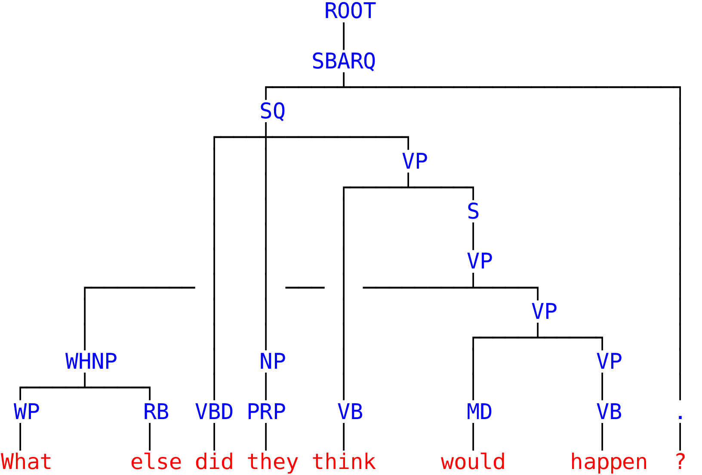

# Mind The Gap

Multilingual discontinuous constituency parsing.

# Compile


Download headers for Eigen and Boost:

```bash
cd lib
bash get_dependencies.bash
cd ..
```

Compile:

```bash
mkdir bin
cd src
make wstring
cd ..
```

NB: without `wstring`, strings will be encoded with basic `char` instead
of `wchar_t`, which will confuse the character bi-lstm.


# Parse with pretrained models:

Pretrained models are in `pretrained_models_disco` for discontinuous constituency parsing
(English, German, French) and `pretrained_models_projective` for projective
constituency parsing (9 languages of the SPMRL dataset).
`ml_gap_lex` and `ml_lex` refer to lexicalized transition systems,
whereas `ml_gap` and `ml` are non lexicalized.


### Parse a bunch of files


Input data (for each file):

- 1 sentence per line, tokens separated by spaces.
- make sure your the input sentences have the same tokenization as in the training corpora (punctuation, etc)
- parentheses must be replaced by `-RRB-` / `-LRB-`.


Parse example:

```bash
cd bin
./mtg2_parser -b 1 -m ../pretrained_models_projective/ml_lex/FRENCH ../data/french/french_sample_wiki*
# -b <beam size> -m <model> [files]+
```

For each file `french_sample_wiki*`, this command will output:
`french_sample_wiki*.discbracket` and `french_sample_wiki*.conll`.
The first one contains predicted constituency trees (1 per line) in discbracket
format (extension of PTB-style bracketed tree).
You can convert them to standard PTB-style trees with [discodop](https://github.com/andreasvc/disco-dop/).
The second file contains conll format dependency trees, including
morphological analyses and dependency labels.

NB: predicted dependency tree evaluation have shown good results 
for French, Hebrew, Korean, Polish, Swedish (languages for which
SPMRL constituency and dependency treebanks have few mismatches, see
[Coavoux and Crabbé, 2017](https://hal.archives-ouvertes.fr/hal-01522313/document), Table 2).

If the model uses a non-lexicalized transition system (`pretrained_models/ml/FRENCH`),
the conll file still contains dependency labels and morphological
analyses, but not dependency trees.

### Parse stdin

You can also read stdin and output constituency trees to stdout:

```bash
echo "Le chat mange une pomme ." | ./mtg2_parser -m ../pretrained_models_projective/ml/FRENCH -b 1
```

However, with this execution mode, the parser will only output constituency trees.

### Example with a discontinuous parse

```bash
$ echo "What else did they think would happen ?" | ./mtg2_parser -m ../pretrained_models_disco/ml_gap/dptb/ -b 1
(ROOT (SBARQ (SQ (VP (S (VP (WHNP (WP 0=What) (RB 1=else)) (VP (MD 5=would) (VP (VB 6=happen))))) (VB 4=think)) (VBD 2=did) (NP (PRP 3=they))) (. 7=?)))
```




